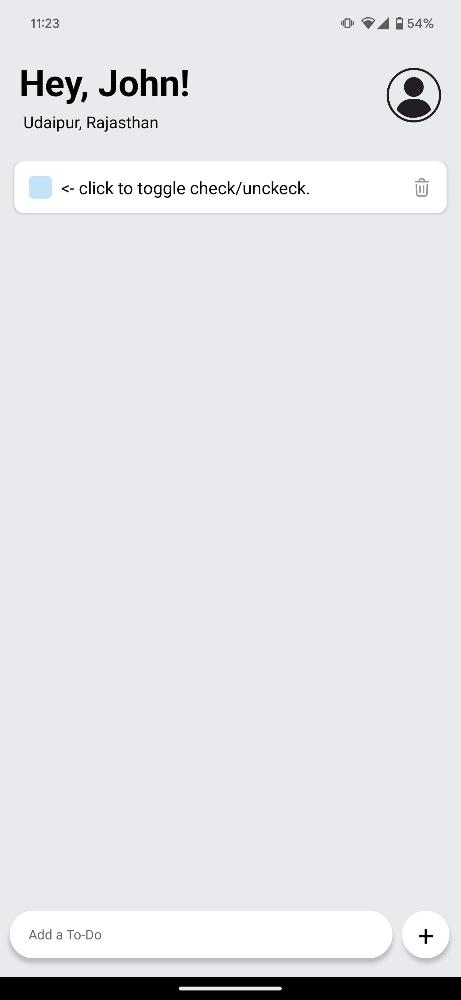
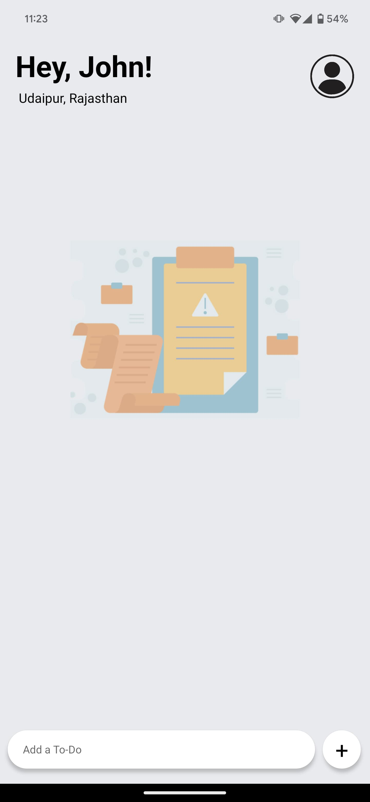
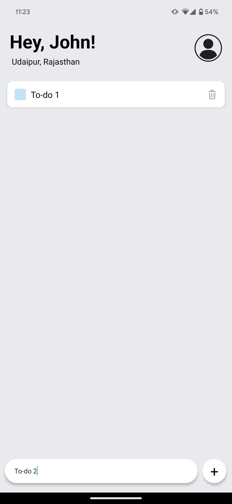

# To-Do App

This is a simple todo application built with React Native and Expo.

## Features

- Add tasks to the todo list
- Mark tasks as completed
- Delete tasks from the list

## Installation

Make sure you have Node.js and npm (or yarn) installed on your machine.

### Using npm

```bash
# Clone the repository
git clone https://github.com/siddnlw/ToDo-app.git

# Navigate to the project directory
cd ToDo-app

# Install dependencies
npm install

# Start the Expo development server
npm start
```

## Screenshots



